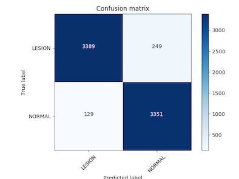
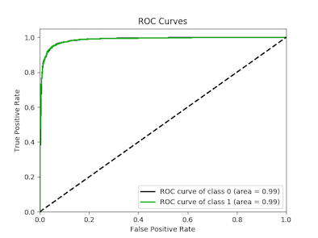

# CheXNet-Pytorch

This is a binary classification(Pneumonia vs Normal) in Xray14 with Pytorch.Densenet121  is adopted directly to train a classifier,which is accessible easily in current mainstream deep learning framework,e.g. Keras,TensorFlow,PyTorch.After 160 epochs of training,I finally achieved a best accuray of `94.98%`.

## Dataset

The [ChestX-ray14 dataset](http://openaccess.thecvf.com/content_cvpr_2017/papers/Wang_ChestX-ray8_Hospital-Scale_Chest_CVPR_2017_paper.pdf) comprises 112,120 frontal-view chest X-ray images of 30,805 unique patients with 14 disease labels.I firstly extracted all normal images and imags with pneumonia,whose numbers are 1353 and 604,12 respectively.Then these images(original size is `1024*1024`) are resized into `256*256 ` and finally I randomly split the dataset into training(`80%`),validataion(`20%`) sets.Obviously,the baises will seriously inclined to to the class with a larger number if neural network is trained roughly with raw dataset because a severely class-imbalance exists.To go further,neural network just guess all inputs as the normal and can perform a "high" accuracy(`~97.81%`).That's the result we don't want to see that because a terrible overfitting occures,which means such a classifier is meaningless.Data augumentation is an effective method to tackle such problems.

## Data augumentation

In this project,data augumentation that is conducted for images with pneumonia is neccessary and makes great sense.The used transforms are as follows:

1. `gaussain_blur:add random gaussain blur with mean=0 and variance=0.1`
2. `gaussain_noise:add random gaussin noise with mean=0 and variance=0.1`
3. `shift:randomly draft image with specified “distance”`
4. `rotation:randomly rotate image with specified angle `
5. `brightness:randomly adjust image's brightness`
6. `contrast:randomly adjust image's contrast`

By data augumentation,the number of images increases 12 times(i.e. `13*1353=17589`) compared with raw dataset.For more details,please check the script [`preprocessing.py`](https://github.com/estelle1722/CheXNet-Pytorch/blob/master/preprocessing.py).

In fact,the class-imbalance problem still exists after data augumentation.For completely eliminating such issise,I remove same normal images util the number of two classes are approximately equivalent.Hence I just randomly select 180,00 images and the left images are left out instead.Ultimately,the directory tree of processed dataset is as follows:

```bash
├── data_augu
│   ├── train
│   │   ├── LESION
│   │   └── NORMAL
│   └── val
│       ├── LESION
│       └── NORMAL
```

## Requirement

- Python 3.6
- [PyTorch 0.3](https://pytorch.org/)

## Usage

1. Clone this repository.
2. Download images of ChestX-ray14 from this [`released page`](https://nihcc.app.box.com/v/ChestXray-NIHCC) then decompress them and finally extract all   normal images and images with pneumonia into the directory `NORMAL_ORIGINAL` and `LESION_ORIGINAL` respectively. 
3. Run the script [`preprocessing.py`](https://github.com/estelle1722/CheXNet-Pytorch/blob/master/preprocessing.py) to accomplish data augumentation.
4. Split the entire dataset into training(`80%`) and validataion(`20%`) sets.
5. Run the script[`main.py`](https://github.com/estelle1722/CheXNet-Pytorch/blob/master/main.py) and train `Densenet121`.

## Evaluation

The runtime environment is shown in the following table:

|       Property        |        Values         |        Note         |
| :-------------------: | :-------------------: | :-----------------: |
|         Model         |      Densenet121      |          -          |
|       Optimizer       |         Adam          |          -          |
| Initial learning rate |         0.001         | decay 0.1/30 epochs |
|         GPUs          | 2*GeForce GTX 1080 Ti |          -          |
|        Epochs         |          160          |          -          |
|    Mini Batch Size    |          50           |          -          |

### Confusion matrix



### Receiver Operating Characteristic(ROC)  & Area Under Curve(AUC)



## More

In addition,[FocalLoss](<https://arxiv.org/abs/1708.02002> ) also with default setting is operated before data augumentation to fix class imbalance.It is a pity that there is no distinct improvement.Another training trick called [Cycle Learning Rate](https://arxiv.org/pdf/1506.01186.pdf)  is a kind of adjusting learning rate .Maybe it works for this project.

Before using densenet121,I try to train resnet18 but without improvement.One reason I think out may be that resnet18 has more trainable parameters than densenet121,which results in larger diffculty to train resnet18.Rather than data augumentation,fine-tune pretrained model is also a common way to do classification(Pneumonia vs Normal).If you are interesed in this idea,I recommend you to refer to this [repository](https://github.com/arnoweng/CheXNet) that obtained most stars in GitHub about this issise.I will feel great appreciated if you realize outstanding performance and make furture disscussion at your convenience because I get stuck in this aspect.

This experiment result origins from initial parameters setting without much tricks.Furture improvement are probably achieved.

Any question,please contact with me.Email(giovannijeann@outlook.com) and WeChat(zhangrong1728) are available.


-------

1.For PyTorch,beside data augumentation there is another useful method called `oversampling` to keep class balance.However,it doesn't work in this project.You can look up the  [python script](https://github.com/estelle1722/CheXNet-Pytorch/blob/master/utils/sampler.py).


 